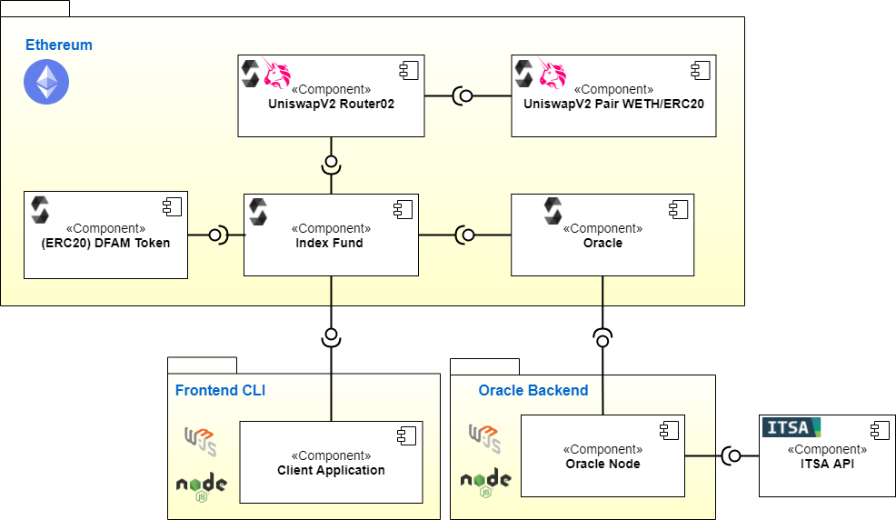
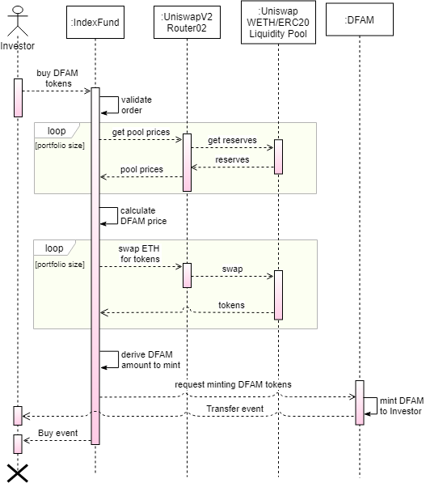
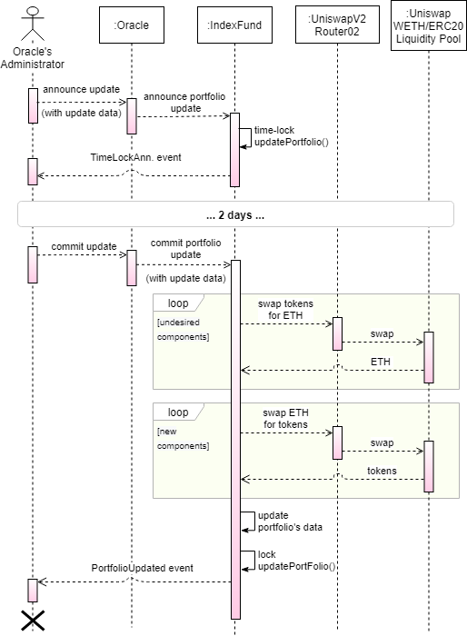

# Index Token for Passive Asset Management

### System Architecture



### Purchasing workflow of DFAM Token



### Portfolio update workflow



## Required Setup
Install the required packages and dependencies:

```console
npm install -g ganache-cli

npm install -g truffle

npm install  # please make sure you're standing in the repo's folder when running this command
```

Compile the contracts:

```console
truffle compile
```

## Configure logging options (optional)
The `LOG_LEVEL` environment variable in `./config/env.test` can be changed to different options to control the log out of the test:
- `debug` to show all debug information during the test
- `info` to show only info logs
- `error` to show only errors

## Run Unit Tests on the Smart Contracts

```console
npm run test
```


## Run the Front-end/GUI Client

On the 1st terminal (at the root directory), run the local blockchain using Ganache
```console
npm run chain
```

On the 2nd terminal (at the root directory), deploy the smart contract ecosystem and start the front-end client
```console
npm run deploy

cd client/
yarn start
```

The front-end can then be accessed using the browser at http://localhost:3000/. Please note that MetaMask or an equivalent wallet software should be installed on the browser in order to interact with the blockchain run by Ganache on localhost. Currently, the front-end has been tested with MetaMask on the Chrome browser (Version 94.0.4606.71).
