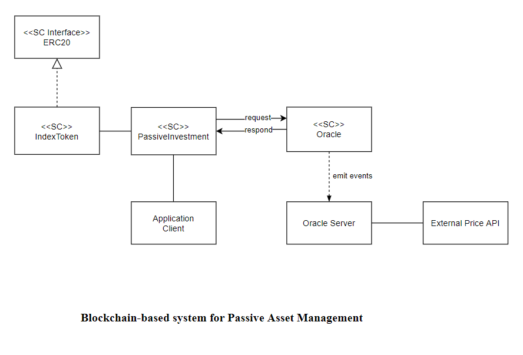
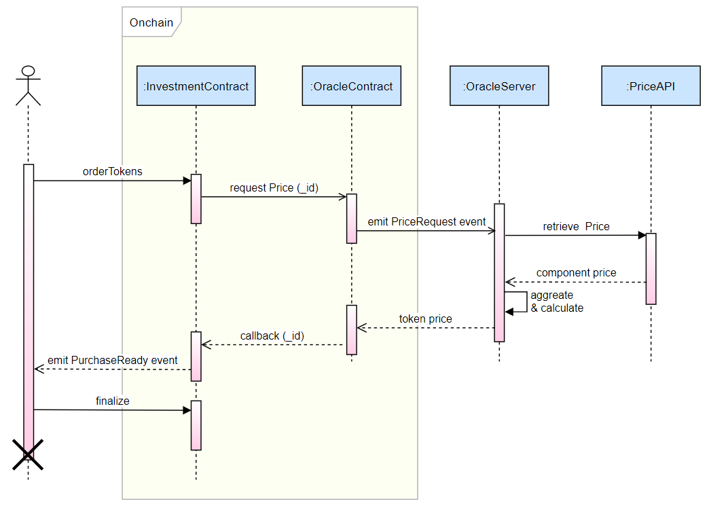

# Index Token for Passive Asset Management

## System sketches

### Overview



### Token purchase workflow



## Steps to run the system

### 0. Setup

```console
npm install
```

### 1. Run a local blockchain using Ganache CLI

```console
npm run chain
```

### 2. Deploy the smart contracts

Three smart contracts are to be deployed:
- Index Token contract: complying with the ERC-20 standard and serves as the token contract.
- (Passive) Investment contract: acting as an interface running all the logic for investors to buy and sell tokens.
- Oracle contract: provides price service by taking price requests from the Investment contract and emitting events to the trusted Oracle servers, which will query the current price from the Internet and send it to the Oracle contract.

We need to let the local blockchain run by ganache run on the current terminal and open a new terminal and run:

```console
node src/deploy.js
```

### 3. Run the Oracle server

The Oracle server will be listening for `PriceRequest` events from the Oracle contract and then querying the current market price of all the component tokens in the porfolio retrieved from one or more external APIs. Next, the prices are aggregated and averaged to calculate the final price for the response back to the Oracle contract.

```console
node src/server.js
```

### 4. Run the Client

Used the client to test the workflow of purchase index tokens through interacting with the Investment contract.

Open the 3rd terminal and run:

```console
node src/client.js
```